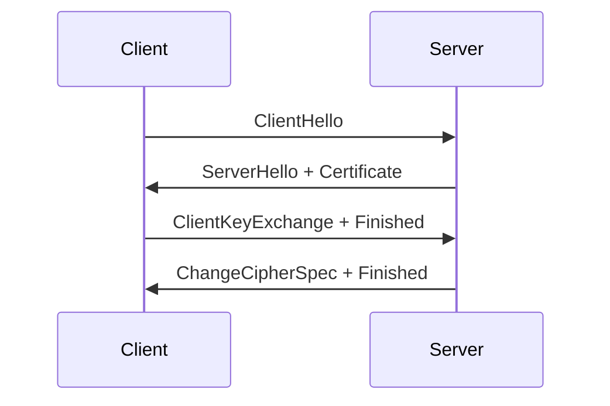

mini-rtc-lab API Reference
============================

## Overview

mini-rtc-lab implements the core WebRTC protocol stack in C99:
signaling (SDP), transport (ICE/STUN/TURN), security (DTLS-SRTP),
media (RTP/RTCP/codecs), and server-side routing (SFU/MCU/BWE).

## Module 1: SDP Signaling (`sdp_signaling.h`)

### Session Description Protocol (RFC 4566)

The Session Description Protocol describes multimedia sessions for the
purposes of session announcement, invitation, and parameter negotiation.

```
v=0
o=- 1234567890 1 IN IP4 0.0.0.0
s=mini-rtc
m=audio 9 UDP/TLS/RTP/SAVPF 111
a=rtpmap:111 opus/48000/2
a=ice-ufrag:aZq1
a=ice-pwd:XrP3kL9mN2sQ5vW8
a=fingerprint:sha-256 AA:BB:CC:...
a=candidate:1 1 UDP 2130706431 192.168.1.10 50000 typ host
```

### API

| Function | Description |
|----------|-------------|
| `parseSessionDescription(sdp_text, out)` | Parse SDP text into struct |
| `generateSessionDescription(sdp, buf, bufsz)` | Serialize SDP to text |
| `generateAnswer(offer, answer)` | Create SDP answer from offer |
| `parseIceCandidate(line, out)` | Parse a=candidate: line |
| `sdpAddCodec(md, id, pt, name, clock)` | Add codec to media section |
| `sdpAddCandidate(md, cand)` | Add ICE candidate |
| `sdpAddExtmap(md, id, uri)` | Add RTP header extension |
| `sdpSetBundle(sdp, enabled)` | Enable BUNDLE |
| `sdpSetRtcpMux(md, enabled)` | Enable RTCP-MUX |

### Media Description (`m=` line)

Contains: media type (audio/video), port, transport protocol,
codec list (a=rtpmap), ICE credentials (a=ice-ufrag/pwd),
DTLS fingerprint (a=fingerprint), SSRC info (a=ssrc), BUNDLE
(a=group:BUNDLE), RTCP-MUX (a=rtcp-mux).

### ICE Candidate (`a=candidate:`)

Format: `foundation component transport priority address port typ type [raddr rport]`
Types: host, srflx, relay

## Module 2: ICE/STUN/TURN (`ice_stun_turn.h`)

### ICE (RFC 5245)

Interactive Connectivity Establishment finds the best path between peers.

State machine:
```
IDLE -> GATHERING -> CHECKING -> CONNECTED -> COMPLETED
                               \-> FAILED
CONNECTED -> DISCONNECTED -> RESTART -> CHECKING
```

Candidate types with type preferences:
- host: 126 (highest, directly attached interface)
- srflx: 100 (STUN reflexive, NAT mapping)
- prflx: 110 (peer reflexive, discovered during checks)
- relay: 0 (TURN relay, lowest priority)

Priority computation:
```
priority = (type_pref << 24) | (local_pref << 8) | (256 - component_id)
```

Pair priority (controlling agent):
```
pair_priority = (G << 32) | D   where G=local, D=remote
```

Connectivity check: STUN binding request with ICE-CONTROLLING or
ICE-CONTROLLED attribute.

### STUN (RFC 5389)

Session Traversal Utilities for NAT.

| Function | Description |
|----------|-------------|
| `stunBuildBindingRequest(msg, tid)` | Create binding request |
| `stunBuildBindingResponse(msg, tid, addr, port)` | Create success response |
| `stunAddAttribute(msg, type, data, len)` | Add TLV attribute |
| `stunAddXorMappedAddress(msg, addr, port)` | XOR obfuscated address |
| `stunAddMappedAddress(msg, addr, port)` | Plain mapped address |
| `stunAddIceControlling(msg, tiebreaker)` | ICE controlling role |
| `stunAddIceControlled(msg, tiebreaker)` | ICE controlled role |
| `stunAddMessageIntegrity(msg, pwd)` | HMAC-SHA1 integrity |
| `stunSerializeMessage(msg, buf, bufsz, outlen)` | Serialize to wire format |
| `stunParseMessage(buf, len, msg)` | Parse from wire format |
| `stunGetMappedAddress(msg, addr, sz, port)` | Extract mapped address |
| `stunGetXorMappedAddress(msg, addr, sz, port)` | Extract XOR address |

### TURN (RFC 5766)

Traversal Using Relays around NAT.

| Function | Description |
|----------|-------------|
| `turnAllocateRequest(msg, tid, lifetime)` | Allocate relay address |
| `turnRefreshRequest(msg, tid, lifetime)` | Refresh allocation |
| `turnCreatePermissionRequest(msg, tid, addr, port)` | Create permission for peer |
| `turnSendIndication(msg, tid, addr, port, data, len)` | Send data via relay |
| `turnChannelBindRequest(msg, tid, ch, addr, port)` | Bind channel number |
| `turnWrapChannelData(ch, data, len, out, outsz, written)` | Encapsulate in channel |
| `turnUnwrapChannelData(buf, len, ch, data, datalen)` | Decapsulate channel data |

## Module 3: DTLS-SRTP (`dtls_srtp.h`)

### DTLS Handshake (RFC 6347)



### SRTP Key Derivation

From the DTLS master_secret, derive:
- client_write_key (16 bytes)
- server_write_key (16 bytes)
- client_write_salt (14 bytes)
- server_write_salt (14 bytes)

### SRTP (RFC 3711)

| Function | Description |
|----------|-------------|
| `srtpEncrypt(key, salt, seq, ssrc, data, len, out, outlen)` | AES-CTR-like encryption |
| `srtpDecrypt(key, salt, seq, ssrc, data, len, out, outlen)` | Decryption (XOR symmetric) |
| `srtpComputeAuthTag(key, data, len, roc, tag)` | HMAC-SHA1-like auth tag |
| `srtpVerifyAuthTag(key, data, len, roc, tag)` | Verify authentication tag |
| `srtcpProtect/key/salt, data, len, out, outlen)` | SRTCP protection |
| `srtcpUnprotect(key, salt, data, len, out, outlen)` | SRTCP unprotection |

## Module 4: Media Track (`media_track.h`)

### RTP Header (RFC 3550)

```
 0                   1                   2                   3
 0 1 2 3 4 5 6 7 8 9 0 1 2 3 4 5 6 7 8 9 0 1 2 3 4 5 6 7 8 9 0 1
+-+-+-+-+-+-+-+-+-+-+-+-+-+-+-+-+-+-+-+-+-+-+-+-+-+-+-+-+-+-+-+-+
|V=2|P|X|  CC   |M|     PT      |       sequence number         |
+-+-+-+-+-+-+-+-+-+-+-+-+-+-+-+-+-+-+-+-+-+-+-+-+-+-+-+-+-+-+-+-+
|                           timestamp                           |
+-+-+-+-+-+-+-+-+-+-+-+-+-+-+-+-+-+-+-+-+-+-+-+-+-+-+-+-+-+-+-+-+
|           synchronization source (SSRC) identifier            |
+-+-+-+-+-+-+-+-+-+-+-+-+-+-+-+-+-+-+-+-+-+-+-+-+-+-+-+-+-+-+-+-+
```

### Opus Audio (RFC 7587)
- TOC byte determines bandwidth, frame count, stereo
- Payload type: 111
- Sample rate: 48000 Hz
- Supported modes: narrowband, mediumband, wideband, super-wideband, fullband

### H.264 Video (RFC 6184)
- NAL unit header: forbidden(1) + nri(2) + type(5)
- FU-A fragmentation for NAL units > MTU
- STAP-A aggregation for small NAL units
- Key frame detection: IDR (type 5) or SPS (type 7)

### VP8 Video (RFC 7741)
- Payload descriptor with picture_id, tl0_pic_idx
- Key frame detection from first byte bit 0
- Optional temporal layer info

### RTCP Packet Types
| Type | Name | Description |
|------|------|-------------|
| 200 | SR | Sender Report (NTP, RTP timestamps, counts) |
| 201 | RR | Receiver Report (loss, jitter, highest seq) |
| 202 | SDES | Source Description (CNAME) |
| 203 | BYE | Goodbye |
| 206 | REMB | Receiver Estimated Maximum Bitrate |
| 192 | FIR | Full Intra Request |
| 206 | PLI | Picture Loss Indication |
| 205 | TWCC | Transport-Wide Congestion Control |

## Module 5: SFU/MCU (`sfu_mcu.h`)

### SFU (Selective Forwarding Unit)

Routes media without decoding/encoding. Layer selection based on:
- Active speaker detection (audio level)
- Bandwidth constraints
- Client capabilities

### Simulcast

Multiple encodings per video track:
```
RID: h -> 1080p @ 2.5 Mbps (active speaker)
RID: m -> 480p @ 800 kbps
RID: l -> 180p @ 200 kbps (non-active speakers)
```

### SFU Functions

| Function | Description |
|----------|-------------|
| `sfuInit(sfu, bw_limit)` | Initialize SFU |
| `sfuAddParticipant(sfu, id)` | Add participant |
| `sfuAddSimulcastLayer(sfu, pid, tid, layer, rid, ssrc, w, h, br)` | Add layer |
| `sfuSelectActiveSpeaker(sfu)` | Select speaker by audio level |
| `sfuSelectLayer(sfu, pid, tid, layer)` | Switch active layer |
| `sfuForwardPacket(sfu, pkt, from, to, out)` | Rewrite and forward |
| `sfuRewriteSsrc(pkt, new_ssrc)` | Rewrite SSRC |
| `sfuHandleRemb(sfu, remb)` | Process REMB bandwidth |
| `sfuApplyBandwidthLimit(sfu, bw)` | Enforce bandwidth cap |

### MCU (Multipoint Control Unit)

Decodes each stream, composites into a single frame, re-encodes.

### BWE (Bandwidth Estimation)

Transport-CC based estimation with Kalman-inspired smoothing:
- Increases when loss < 2% (additive increase)
- Decreases when loss > 10% (multiplicative decrease)
- REMB receiver-side estimates override sender estimates

| Function | Description |
|----------|-------------|
| `bweInit(bwe, min, max)` | Initialize estimator |
| `bweUpdateOnPacket(bwe, info)` | Feed packet info |
| `bweUpdateOnFeedback(bwe, now, acked, loss)` | Process feedback |
| `bweUpdateOnRemb(bwe, bitrate)` | REMB receiver estimate |
| `bweUpdateOnTwcc(bwe, twcc, now)` | Transport-CC feedback |
| `bweGetTargetBitrate(bwe)` | Current target bitrate |

## Building

```
cd mini-rtc-lab
make all
```

All code is ANSI C (C99) with no external dependencies beyond libc.
